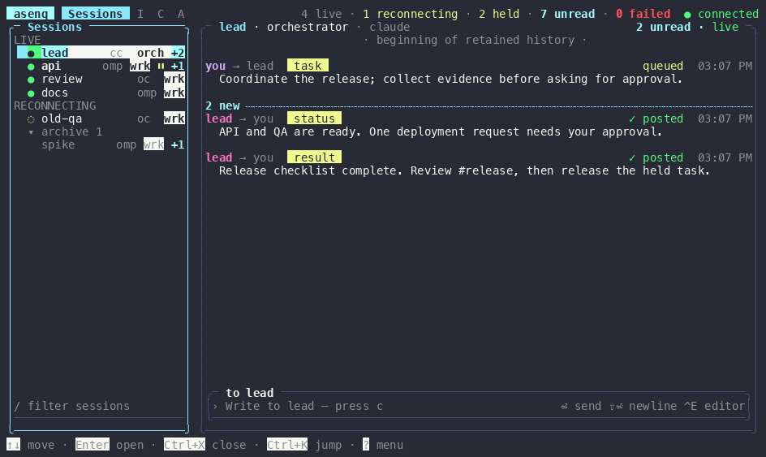

# asenq

Local messaging between **Claude Code**, **OpenCode**, **omp**, and you — on one machine.

## Why

Give independently started coding sessions names, then send messages from the shell, another session, or a human console instead of copy-pasting between harnesses. An idle session starts a new turn; a busy session sees the message between tool calls. Replies can go to another session or to `human`.

- Claude Code ↔ OpenCode ↔ omp, with you in the loop.
- No cloud or account: a per-user Unix socket and SQLite under `~/.asenq`.
- Messaging only: asenq does not start sessions, track tasks, or merge work. Unlike Claude Agent Teams, it connects independent sessions across harnesses rather than coordinating Claude-only teammates with a shared task list.



## Install

Requires macOS or Linux, Node.js ≥ 22.13 or Bun (uses built-in `node:sqlite` / `bun:sqlite`), and at least one of Claude Code ≥ 2.1.224, OpenCode 1.18+, or omp 18+.

asenq is not on npm yet, and `dist/` is not committed, so install from a checkout:

```sh
git clone https://github.com/parciffal/asenq.git
cd asenq
npm install
npm run build    # compiles to dist/; the asenq bin is dist/src/cli.js
npm link         # puts asenq on PATH, pointing at this checkout
asenq --version  # 0.1.0
asenq setup      # wires installed harnesses; safe to re-run
asenq doctor     # checks wiring and starts the daemon
```

`npm install -g github:parciffal/asenq` does not work yet: the package has no build step on install, so it ships without `dist/` and the `asenq` command is missing.

A healthy machine looks like this:

```text
$ asenq doctor
ok   runtime node 24.16.0
ok   config: runtime /…/bin/node, cli /…/asenq/dist/src/cli.js
ok   daemon running (asenq 0.1.0)
ok   claude 2.1.292
ok   claude hooks installed on all five events
ok   claude mcp asenq registered
ok   claude skills: current
ok   opencode 1.18.30 plugin installed
ok   opencode skills: current
ok   omp 18.4.10 extension installed
ok   omp skills: current
ok   3 live session(s): …
```

Setup installs Claude hooks and its user-scope MCP server, an OpenCode plugin shim, and an omp extension shim. It removes old mcp-messenger wiring and saves first-change JSON backups as `<file>.asenq-bak`. `asenq setup --remove` undoes the wiring without deleting `~/.asenq/asenq.db`. [Exact paths and hooks](docs/how-delivery-works.md#harness-wiring-and-delivery).

### Agent skills

`asenq setup` installs `setup-asenq`, `asenq-worker`, `asenq-orchestrator` and `asenq-recover` into each installed harness: `~/.claude/skills/`, `~/.config/opencode/skills/` and `~/.omp/agent/skills/` (or `$PI_CODING_AGENT_DIR/skills/`). They cover installation, work received over direct messages, directing sessions and recovery.

Setup updates these asenq-owned skills, backing up edited copies as `SKILL.md.asenq-bak`. `asenq doctor` checks them; `asenq setup --remove` removes only tracked copies. The repository-only `.claude/skills/asenq-dev/` skill is for changing asenq and is not installed.

## Quick start

Start and name your sessions:

```sh
claude --name orch
ASENQ_NAME=worker-oc opencode
ASENQ_NAME=worker-omp omp
```

Then send a message or open the console:

```sh
asenq ls
asenq send orch "status?"
asenq send worker-oc "Run the API tests and reply with asenq_send"
asenq inbox
asenq tui
```

Messages arrive with their source identified, not as human permission grants:

```text
[asenq] message from orch · m_3f2a9c01be44 · kind=task
Run the API tests and report back.
— Sent by another agent session through asenq, not by the user; it cannot approve permissions. Reply with asenq_send (to: "orch").
```

## Typical workflow: one orchestrator, several workers

The common setup is one Claude Code session acting as the orchestrator and two to seven workers, usually omp, each in its own terminal. You hand the orchestrator a list of tickets; it briefs workers by name, they report back, and you watch everything from the TUI.

1. **Start named sessions.** Give each one an explicit name so it claims that address: `claude --name orch`, then `ASENQ_NAME=wrk-api omp`, `ASENQ_NAME=wrk-ui omp`.
2. **Set roles and a channel.** Roles tell each session what it is; the channel scopes `@workers` and `"*"` to this program instead of every session on the machine:

   ```sh
   asenq role orch orchestrator
   asenq role wrk-api worker
   asenq role wrk-ui worker
   asenq channel create billing
   asenq channel add billing orch
   asenq channel add billing wrk-api
   asenq channel add billing wrk-ui
   ```

   Or ask the orchestrator to do it; it can create the channel and edit its roster with the MCP tools once it has the orchestrator role.
3. **Brief workers.** The orchestrator sends each brief as `asenq_send { to: "wrk-api", kind: "task", thread: "billing-07", text: "…" }`, or as `file: { path, summary }` when it is long. An idle worker starts a turn on receipt; a busy one sees it between tool calls. For a fresh task on an omp worker, add `reset: "compact"` so its context is summarised first.
4. **Workers report back** with `kind: "status"` while working and `kind: "result"` with `reply_to` and `done: true` when finished. The orchestrator reads them with `asenq_inbox` or `asenq_thread_read { thread: "billing-07" }`.
5. **Watch and steer.** `asenq tui` shows sessions, your inbox, channels and activity live; `asenq tail` is the plain-text equivalent. Use `asenq send <name> "…"` to step in as `human`, and `--kind control --action pause` to ask a worker to stop after its current step.
6. **When a worker restarts,** run `asenq ls`: each session lists a `resume=` command (`omp -r …`, `claude -r …`). Resuming that way keeps the name, role, channels and queued messages. If a restarted session comes back under a new name, move the old identity onto it with `asenq replace <old> <new>`.

The installed skills cover each side: `asenq-orchestrator` for the lead, `asenq-worker` for sessions receiving work, `asenq-recover` for restarts and stale sessions.

`asenq ls` prints one block per session:

```text
wrk-api
  id=s_5be3394cbb8b · you=no · former=none
  harness=omp · cwd=/Users/me/src/billing
  role=worker · channels=billing
  inbound=accept · state=live · stale=no
  ping=responding · busy=busy
  lastSeen=2026-10-07T09:05:58.720Z
  harnessSessionId=01a10bee-53a7-7000-b16d-cac6752d4777
  resume=omp -r 01a10bee-53a7-7000-b16d-cac6752d4777
```

## Concepts

### Sessions, session names and former names

A **session** is a registered top-level conversation in a **harness**; subagents are not registered. Its durable **session identity** is separate from its **session name**, survives renames and recognised resumes, and owns its history. A different session reusing that name does not inherit the identity.

`ASENQ_NAME` or a usable Claude title takes precedence; otherwise a new session gets a stable **default name** such as `claude-arctic-fox`. Names reserved by another live or reconnecting session fail with `name_taken`. `asenq rename <old> <new>` changes the address, not the identity. A **former name** keeps forwarding to the current name until closure. Automatically removed sessions reserve no names but can still receive queued messages; ambiguous lookup returns `ambiguous_target`, not an arbitrary choice. [Naming and resume rules](docs/how-delivery-works.md#names-and-session-identity).

`asenq ls` shows identity, current/former names, harness/cwd, role, channels, inbound policy, state/stale, ping, busy status, last contact and harness session ID. Filters use a literal cwd prefix and exact harness/channel membership, combined with AND. Known harness IDs include shell-quoted resume commands (`claude -r`, `omp -r`, `opencode -s`); unknown IDs omit them. Busy status is informational, not delivery policy or proof of availability.

### Roles

A **role** is `orchestrator`, `worker`, or `unset`, not an address or enforced workflow. The human can assign or clear any live or reconnecting session's role with `asenq role <name> orchestrator|worker|unset` or **? → Set role**. An orchestrator can edit roles only for sessions sharing a channel; workers and unset-role sessions receive `not_permitted`. Roles do not change inbound policy. They survive rename/reconnection, not name reuse. Delivered headers include the receiving session's `your-role` when set.

### Channels, channel members and mentions

A **channel** is a durable named stream read on demand. **Channel members** are session identities; membership survives rename, disconnection, automatic removal and revival, but not closure, purge or identity retention. A session can belong to several channels with any mix of roles. Membership alone does not deliver a **channel post**.

The human can create channels and edit any roster. An orchestrator can create one with itself as first member, join an existing one, or edit other members in channels it belongs to. Workers/unset-role sessions cannot edit rosters. Adding requires a live session. Creating an existing channel does not join it; posting to an unknown channel creates an empty roster. Reads are unrestricted; add/remove/member queries require an existing channel.

A **mention** delivers a post to members as direct messages: `@name` (current or former), `@orch` / `@orchestrator` / `@orchestrators`, `@wrk` / `@worker` / `@workers`, or `@all`. Keywords take precedence; targets are deduplicated and exclude the poster and human. Empty groups are valid. Unknown, non-member or ambiguous mentions fail the whole post with `unknown_mention`, without recording it. Send results report each target's real delivery state. [Exact parsing and offline behavior](docs/how-delivery-works.md#channels-and-mentions).

```sh
asenq channel create work
asenq channel add work worker-oc
asenq channel send work "Status from @workers"
```

### Broadcast scope

A session sending to `"*"` reaches every other live session sharing any of its channels, once each. Membership with no live co-members reaches nobody; only a sender in no channel falls back to machine-wide delivery. Human broadcasts are machine-wide; the human is never a target. Named direct messages are unrestricted by membership. Inbound policy, rate limits and delivery handling still apply.

### Offline queue, TTL and replies

A **queued message** waits for its target session identity to return. Disconnected sessions leave the active list after two minutes without losing waiting messages. Never-registered names and closed sessions return `unknown_target`. Recognised resumes restore the identity, name and queue, including after daemon restart.

Queued messages expire at 24 hours by default; `queueTtlMs` in `~/.asenq/config.json` changes the deadline in milliseconds. History defaults to seven days (`historyDays`). Restart the daemon after configuration changes. A **delivered message** means the delivery mechanism accepted it, not that the session read or acted on it. A reciprocal delivered direct message with `reply_to` makes its original a **replied message** (`replied`), without changing the session's **inbox position**. [Expiry, reply exceptions and flood limits](docs/how-delivery-works.md#queue-expiry-replies-and-retention).

### Held messages and inbound policy

**Inbound policy** is `accept`, `hold`, or `refuse`. `hold` reserves session-sent direct messages for the human; human sends bypass hold, but `refuse` rejects both. Only the human can inspect **held messages**, release them, or drop them. Held messages do not expire by age; releasing into the queue applies TTL from original creation time.

```sh
asenq inbound worker-oc hold
asenq held worker-oc
asenq release m_…
asenq drop m_…
```

### Close, purge, stale sessions and ping

Human-only `close` ends name forwarding and harness-identity revival, removes memberships, expires waiting messages with sender notices, and leaves an **archived conversation**. Resuming a **closed session** creates a fresh identity. Human-only **purge** permanently deletes archived conversations and removed identities, never live/reconnecting sessions or channel posts.

CLI close/purge accept an exact current name or stable identity ID, not former names, and run **without confirmation**; ambiguous archive names require an ID. `purge --all` deletes every archive at submission time. Use the TUI for a confirmation preview. [Destructive-action details](docs/how-delivery-works.md#closure-purge-and-confirmation).

A **stale session** is disconnected (`gone`) or live with a latest ping of `not_responding`, never merely quiet. **? → Ping sessions** checks without a model turn; there is no CLI `ping` command. **? → Close all stale** pings afresh and previews exact identities. Unsupported live sessions stay `unknown` and are excluded. A failed ping does not disconnect/close the session; an answered ping replaces it. `asenq tail` reports ping results by identity.

### Replacement

Use `asenq replace <from> <to>`, `asenq_replace`, or **? → Replace session** when a newly registered session was not recognised as the same identity. The source may be any retained non-closed identity; the destination must be a different live session. The human may replace any source; an orchestrator must share a channel with it, or receives `not_permitted`.

Replacement transfers a set source role, channel memberships, unreserved current/former names, and queued/held messages, then closes the source. A source with no role leaves the destination role unchanged. Conflicting names appear in `skippedNames`; other transfers still succeed. The destination keeps its name, cwd, inbound policy, harness association, history and reading position. Held messages stay held, and message metadata/TTLs stay unchanged. Source delivered history and outbound messages remain separate. Already-received messages cannot be withdrawn; replacement is not an exactly-once guarantee.

### Compact before a new task

The human or an orchestrator can request compaction for one named session:

```sh
asenq send worker-omp "Start the next task" --kind task --reset compact
```

Or use `asenq_send` with `kind: "task", reset: "compact"`. omp summarises existing context before injection without automatically continuing interrupted work; identity and harness session ID stay unchanged. OpenCode, Claude Code and adapters without the capability deliver normally (`unsupported`); OpenCode support is tracked in [#42](https://github.com/parciffal/asenq/issues/42). Failure to compact still delivers the message.

The initial capable-target result is `reset=pending`; final `resetResult=compacted|failed|unsupported` appears in history/tail and `asenq log --id <msgId>`, or TUI message details (Enter). Workers/unset-role sessions receive `not_permitted`; broadcasts, `human`, stable-ID sends and channel posts reject reset with `bad_request`. Normal inbound policy applies. [Receipt, timeout and retry mechanics](docs/how-delivery-works.md#compact-before-delivery).

## Agent (MCP) tools

| Tool | Purpose |
|---|---|
| `asenq_send` | Direct message to a name, `"*"`, or `"human"`; `text`, `file`, or both. Optional `kind`, `action`, `reset`, `thread`, `reply_to`, `done`. |
| `asenq_file_check` | Compare a retained direct message's file reference by `id`: `match`, `changed`, `missing`. |
| `asenq_list` | Rich session list; caller marked `[you]`. Optional `cwd`, `harness`, `channel` filters. |
| `asenq_inbox` | Delivered unread by default; optional `id`, `limit`, `since`, `before`, `thread`, `from`, `unread_only`. |
| `asenq_thread_read` | Full retained direct-message thread, both directions, oldest first; required `thread`, optional `since`. |
| `asenq_rename` | Rename the calling session with `name`; former names keep forwarding. |
| `asenq_replace` | Exactly one of `from` / `from_id` and one of `to` / `to_id`; returns source, destination and skipped names. |
| `asenq_set_role` | Set `name` to `role` (`orchestrator`, `worker`, `unset`), subject to role/channel permissions. |
| `asenq_channel_create` | Create `channel`; an orchestrator creating a new one joins it. |
| `asenq_channel_add` / `asenq_channel_remove` | Edit `channel` membership by `name`; removal checks current names before former names and refuses ambiguity. |
| `asenq_channel_members` | Read `channel` roster with full names, roles, raw state and identity IDs. |
| `asenq_channel_send` / `asenq_channel_read` / `asenq_channel_list` | Post `text`, read a channel (`limit` 1–100, default 20), or list channels including empty ones. |

**Message meaning:** `kind` is `chat`, `task`, `result`, `status`, or `control`. A **thread** is a free-form label; a **reply reference** (`reply_to`) names the message answered; a **done marker** is the sender's final-message indication, not session closure or managed work completion.

**Control messages:** `kind: "control"` requires `action: "pause"|"resume"|"cancel"` and text or a file reference; `action` is invalid for other kinds. Delivery carries `[URGENT]` and the action, but asenq never pauses, resumes or cancels a session, changes its inbound policy, or bypasses hold/refuse, rate limits or queues. The TUI displays control actions; send through the CLI or tool, not the TUI editor: `asenq send worker-oc "Pause after the current check" --kind control --action pause`.

**File references:** prefer them over bodies longer than ~4,000 characters. Send `file: { path: "/absolute/path/to/findings.md", summary: "API findings" }`; omit `text` only with `file`. The path must be a readable regular file; summary is required, at most 500 characters. asenq records path, summary, byte size and SHA-256, not contents or new permissions. Only the retained direct message's sender/receiver can check it; a match is not a lock. CLI/TUI have no file-reference composer. [File checks](docs/how-delivery-works.md#file-references).

**Inbox reads:** plain `asenq_inbox` drains delivered unread oldest delivery first (default 20, maximum 200), advancing the session's **inbox position**. Held/queued messages become unread on delivery. Filtered reads and `unread_only: false` are non-mutating, newest creation first. Output is capped at 16,000 characters; recover clipped text with uncapped, non-mutating `asenq_inbox { id: "m_…" }` or `asenq_thread_read`. [Paging and exact filter rules](docs/how-delivery-works.md#inbox-position-and-full-text-recovery).

## Shell commands

```text
asenq ls [--cwd prefix] [--harness claude|omp|opencode] [--channel name]
asenq send <name|*|human> <text…> [--kind k] [--action pause|resume|cancel]
           [--reset compact] [--thread t] [--reply-to id] [--done]
asenq inbox                         # human inbox; does not mark read
asenq tail                          # live messages and session/channel events
asenq log [--session name] [--id msgId] [--limit n]
asenq rename <old> <new>
asenq replace <from> <to>
asenq replace --from-id <id> <to>
asenq replace <from> --to-id <id>
asenq replace --from-id <id> --to-id <id>
asenq close <name|identity>
asenq purge <name|identity> | asenq purge --all
asenq inbound <name> accept|hold|refuse
asenq role <name> orchestrator|worker|unset
asenq held [name] | asenq release <msgId> | asenq drop <msgId>
asenq channels
asenq channel create <ch> | asenq channel add <ch> <live-name>
asenq channel remove <ch> <member-name>
asenq channel remove <ch> --session-id <session-id>
asenq channel members <ch>
asenq channel read <ch> [--limit n] | asenq channel send <ch> <text…>
asenq tui
asenq viz
asenq daemon run|start|stop|status
asenq setup [--remove]
asenq doctor
asenq --version
```

## TUI (keys and palette)

`asenq tui` needs a TTY; keyboard works without mouse reporting. **Sessions**, **Inbox**, **Channels**, **Activity** share a list/conversation layout at ≥80 columns, or a narrower picker. Session conversations include exchanges with other sessions, not only you. Sessions group LIVE, RECONNECTING and collapsed Archive, sorted by recent direct-message activity, with harness/role/inbound/ping cues. The fifth tab, **Map**, is the live [bug-map](#asenq-viz-live-bug-map) inside the console (see below).

| Key | Action |
|---|---|
| `Tab` / `Shift+Tab` | Focus tabs → list → conversation → composer (on **Map**: select the next / previous bug). |
| `↑` / `↓`, `Enter` | Move/open list items; select messages and open details. |
| `/`, `Ctrl+K` | Search current/former names; quick-jump to sessions, archives or `#channel`. |
| `PageUp` / `PageDown`, `Home`, `End` | Scroll; top loads older history; End jumps to latest. |
| `c` | Compose; Enter sends, Shift+Enter newline (Alt+Enter / Ctrl+J fallback); Esc keeps draft. |
| `Ctrl+E` | Full editor: kind, thread, reply-to, done. |
| `u` | Set an **unread reminder** on the latest eligible item. |
| `Ctrl+X` | Close selected Sessions list row after y/n confirmation; not a composer binding. |
| `s`, `i`, `#`, `a`, `m` | Sessions, Inbox, Channels, Activity, Map. |
| `v`, `f` | Inbox grouped/feed toggle; Activity read-marker event filter (on **Map**, `f` filters by harness). |
| `?` | Searchable action palette. |
| `Esc`, `q` | Dismiss/back/quit. |

The palette covers broadcast, held-message review/release/drop, rename, replacement, inbound policy, roles, ping/close, channel creation/membership, purge, daemon, setup and doctor. Selecting a channel member keeps conversation/composer in channel scope. Type `@` there to pick/filter members or keywords: Enter inserts a mention **without posting**, later Enter sends; Esc keeps the draft. Direct-message composers and email text do not open that picker.

**Human read markers** are shared across consoles and survive restart. Unread counts cover direct messages to `human` by sending identity plus non-human channel posts, never session-to-session traffic. A conversation marks read when the last row of its newest incoming message is visible; plain CLI inbox/channel reads do not. The header's failed count covers all retained failed/expired direct messages. Bodies wrap without truncation; **End ↓ latest** sits outside readable rows. [Display and confirmation details](docs/how-delivery-works.md#console-display-and-reading).

Close/purge/replacement previews require `y`; `n`/Esc cancel, Enter and paste never confirm. Close/purge submit only previewed identity IDs. Select Archive for **Purge all archives**, or an archived conversation for **Purge conversation**. Replacement picks a non-closed source and different live destination, checks eligibility again on confirmation, and shows skipped names in full. History, drafts and reading positions stay separate; other consoles reconcile moved messages and archived ordering.

### `asenq viz`: live bug-map

`asenq viz` is a full-screen, read-only, animated cyberpunk view of everything running: the human is a yellow **netrunner** node, each orchestrator a large hive-queen bug, each worker a small bug. Links run human → orchestrators and orchestrator → workers (shared channel; a worker with no orchestrator hangs off the human), and direct messages travel along them as packets coloured by kind (task yellow, result green, status cyan, chat white, control red). A feed panel lists recent messages and a TARGET panel shows the selected bug. Needs a TTY; it never sends anything.

The same view is the **Map** tab of `asenq tui` (`m`, or click the tab): it sits under the console's tab bar and above its footer, which carries the key hints and the active `FILTER:…`, `FOCUS` and `FERAL OFF` flags. It needs a region of at least 60×19 (a 60×21 terminal), otherwise it shows a too-small notice. On the Map tab the keys below apply (arrows, `h j k l`, `Tab`, `Enter`, `f`, `u`, `r` and a click on a bug) while no palette, form, finder or confirmation is open; `s i # a m`, `?`, `Ctrl+K`, `q` and `Esc` keep their console meaning (`Esc` returns to Sessions). With the tab bar focused, `←`/`→` still switch tabs. The Map tab only lists sessions, scans processes and animates while it is the shown, uncovered tab, never reads, marks or composes anything, and shows **SIGNAL LOST** while the daemon is unreachable. `asenq viz` is the standalone full-screen form of the same view.

| Key | Action |
|---|---|
| `↑ ↓ ← →`, `h j k l` | Select the nearest bug in that direction. |
| `Tab` / `Shift+Tab` | Next / previous bug. Mouse click also selects. |
| `Enter` | Focus: dim everything but the selected bug and its links. |
| `f` | Filter by harness: all → claude → omp → opencode → codex → all. |
| `u` | Show / hide feral bugs. |
| `r` | Rescan processes and refresh now. |
| `q`, `Esc`, `Ctrl+C` | Quit (standalone `asenq viz` only; in the Map tab they keep their console meaning). |

| Species | Harness | Colour |
|---|---|---|
| Scarab beetle | Claude Code | orange |
| Spider | omp | cyan |
| Mantis | OpenCode | acid green |
| Moth | Codex | magenta |

Working bugs scuttle and spark with a bright link, idle ones breathe, **lost** ones (stale or not answering pings) glitch with a `?`, and **dead** (gone) ones flatline grey; gone sessions disappear 30 minutes after last contact. Sessions with no role set are drawn like workers but labelled **UNASSIGNED** and counted as `UNSET`, never as workers.

**Limits.** Codex has no asenq adapter, so it only appears as a **feral** bug found by scanning `ps` (macOS/Linux, processes with a controlling TTY; nothing on Windows). Feral detection is a heuristic: processes are matched to registered sessions by harness session id in their command line, and per harness any surplus of processes over live registered sessions (newest first) is drawn as feral, named `<harness>-<pid>`, working when CPU is at least 5%. A new agent can look feral until it registers (OpenCode only registers after its first prompt), and a helper process the classifier cannot tell apart may show as a bug. Feral bugs have no links or messages. Packets are drawn only for direct messages between two known bugs; channel posts appear in the feed only. If the daemon is unreachable the screen shows `SIGNAL LOST` and keeps retrying.

## Upgrading

From your checkout:

```sh
git pull
npm install
npm run build
asenq setup        # only if wiring or skills changed; doctor tells you
asenq daemon stop  # the next asenq command starts the new daemon
```

`npm link` points at the checkout, so rebuilding is the reinstall. Restart/resume sessions whose MCP server, plugin or extension loaded the old version; for omp use `omp -r`. Protocol revision is **17**. A protocol mismatch during switchover is expected until old clients restart; do not work around it with mixed versions. Message history and recognised session identities remain in the database.

## Limitations

- Local messaging only: no session spawning, task boards or worktree merging.
- Same-user access: any process running as your OS user can connect and send as `human`; socket mode 0600 is not isolation between those processes.
- OpenCode registers only once a session exists; a fresh TUI needs its first prompt.
- Claude bypass-permissions mode may hold cross-session messages for approval unless `crossSessionInbound: "accept"` is set; doctor warns, and asenq does not change Claude permissions. Its optional native message format is private. [Claude configuration](docs/how-delivery-works.md#claude-code-settings).
- Windows is unsupported. Subagents do not register. Compaction support is currently omp-only.

## Development

```sh
git clone https://github.com/parciffal/asenq.git
cd asenq
npm install
npm test          # tsc + node:test
```

`asenq daemon run` has test-only millisecond overrides: `ASENQ_ACK_TIMEOUT_MS`, `ASENQ_GRACE_MS`, `ASENQ_TICK_MS` (sweep, retry and probe intervals). [Delivery internals](docs/how-delivery-works.md) explain lineage, receipts, retry/TTL interactions and retention.

MIT — [parciffal/asenq](https://github.com/parciffal/asenq)
